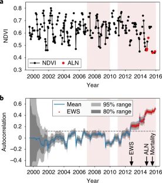
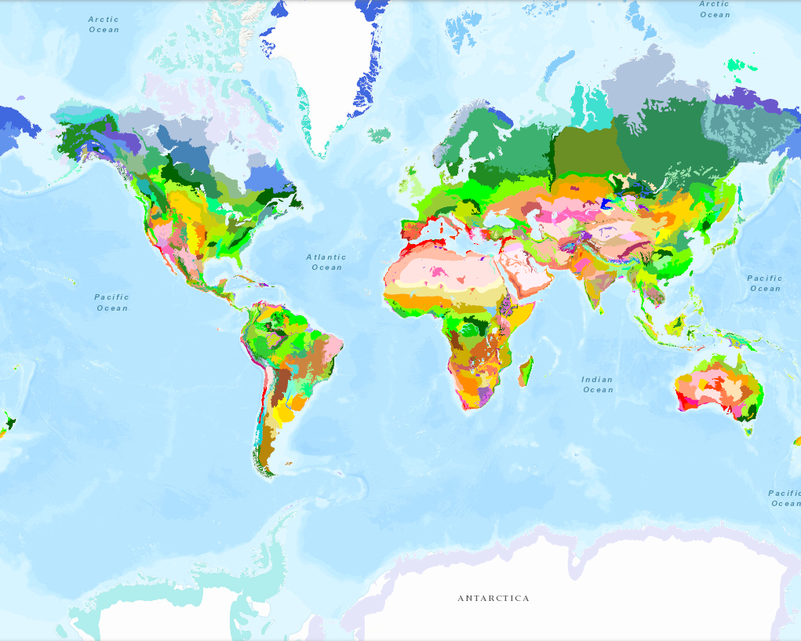
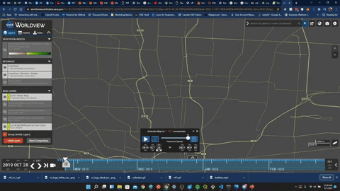
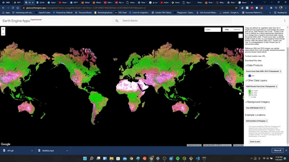
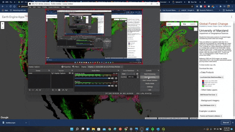

# NFF (Non Fungible Forests)
The purpose of this project is to build an NFT Collection where every NFT represents one hectare of Earth. Satellite imagery is used to determine the historical quality of vegetation within the hectare, and as organizations integrate carbon pricing into Environmental Sustainability Governance (ESG), this market of environmental integrity histories will allow us to experiment with how we attribute value to carbon practices.

## Approach to linking NTFs to ecosystem integrity
By linking each hectare to an NFT, we are building a collection of largely agreed upon metrics to evaluate the ecological integrity of that hectare, and then let the market determine the value of the sustainability of that hectare. As adoption grows, and more demand for environmental accountability increases, this is a prototype of how we could accelerate sustainable ecosystem practices. 

### Some defining metrics
1. Create a historical timeline of the NDVI values in that hectare. Include insights about significant ecological events if possible 
 
1. Define the [ecoregion](https://databasin.org/maps/new/#datasets=68635d7c77f1475f9b6c1d1dbe0a4c4c) of the hectare. 
 

## NFF Collection
A library of early prototypes of the NFF functionality. Initially just getting bare bones functionality working 
[https://opensea.io/collection/non-fungible-forests](https://bit.ly/3BMchy0) 
 

### Collectible #1: 
This one is a NDVI timelapse from NASA's EODIS Worldview 
[https://opensea.io/assets/0x495f947276749ce646f68ac8c248420045cb7b5e/23855157975821296213591829291147014821979655616936360978435112360207414460417](https://bit.ly/3EPZix8) 
 

---
### NFF#1 (Original)
This one is was made using a screencapture of the Global Forest Watch viewer
 
[OpenSeas NFF#1(Original)](https://bit.ly/3mQZ9n3)

---
### Attributions
The initial source of data is the University of Maryland's [Global Forest Watch](https://data.globalforestwatch.org/) Data.
Source: Hansen/UMD/Google/USGS/NASA

Additional GIFs were made with NASA's [Worldview](https://worldview.earthdata.nasa.gov/) viewer

Used this tutorial: [https://www.youtube.com/watch?v=K0fq8BMScEc](https://www.youtube.com/watch?v=K0fq8BMScEc)
1. pip install myqr
1. python gif_QRCode.py
